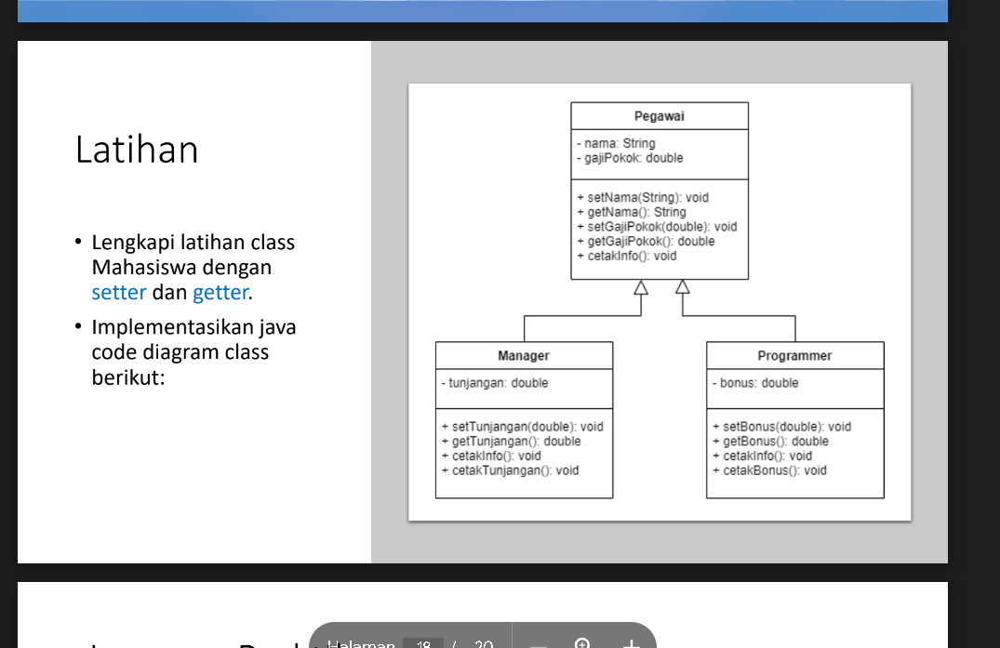
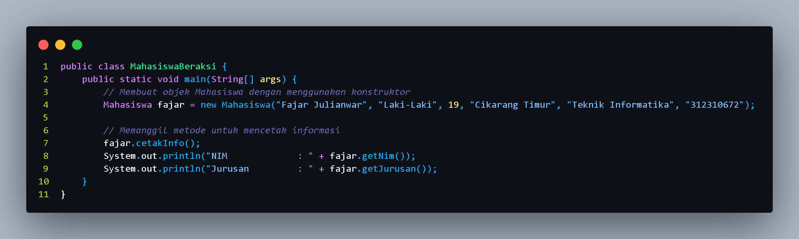
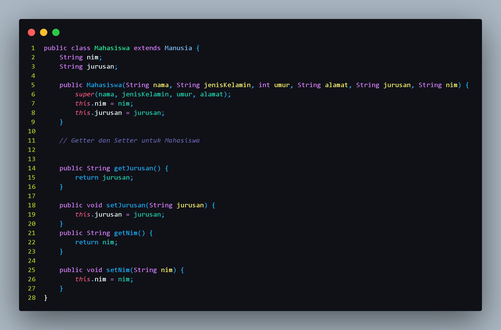
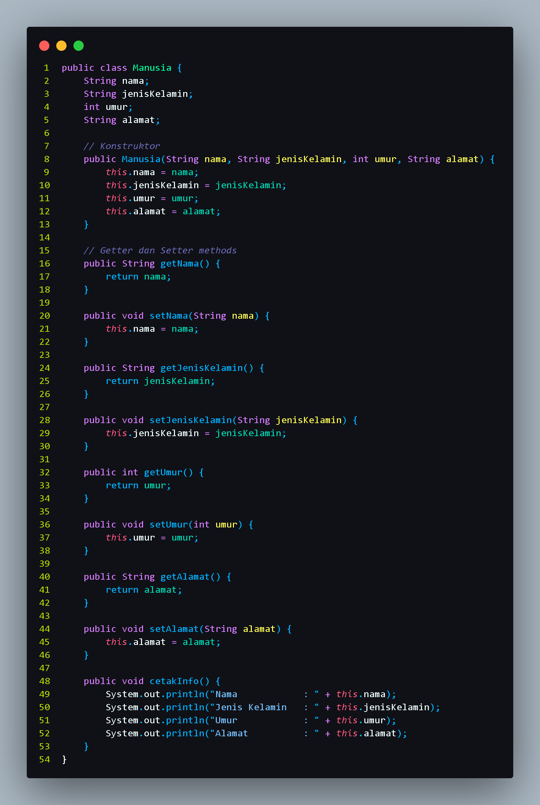
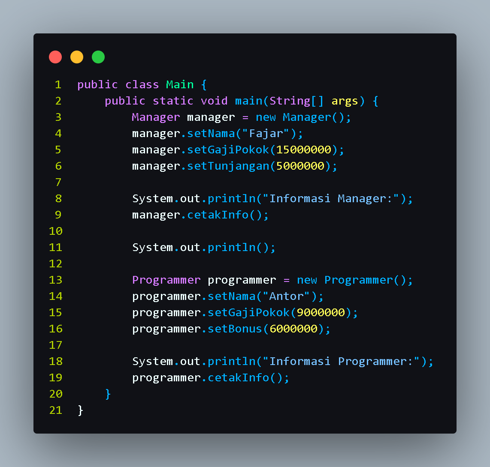

# Pemrograman Orientasi Object praktikum4

## Latihan 1

**1. Lengkapi Latihan Class Mahasiswa Dengan Setter Dan Getter.**

  
  
  

**OUTPUT**
  

**2. Implementasikan Java Code Diagram Class Berikut**

**pegawai, manager, dan programer**

**OUTPUT**

